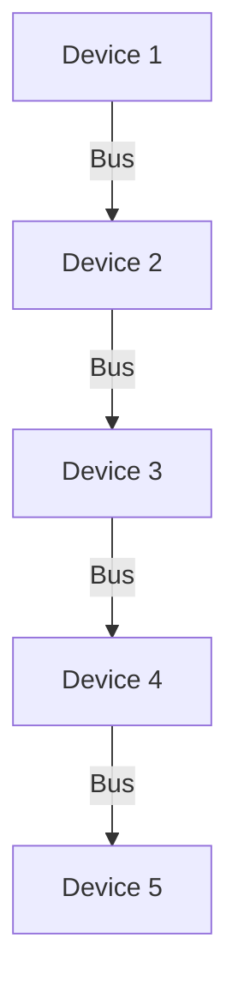
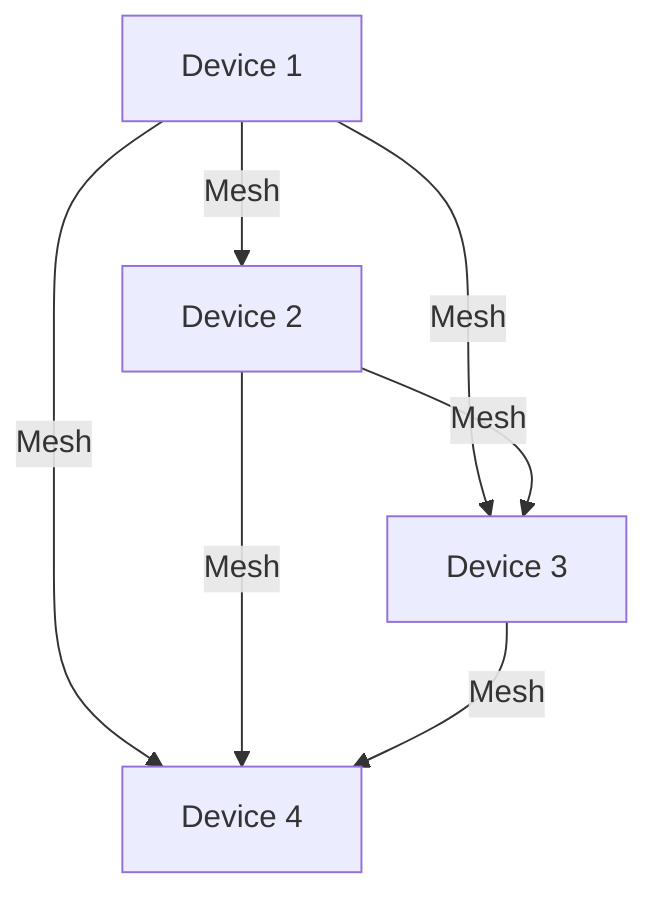
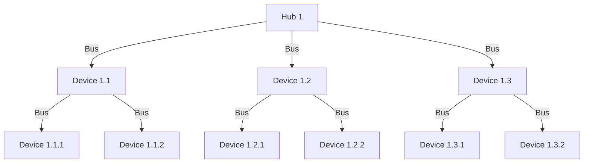
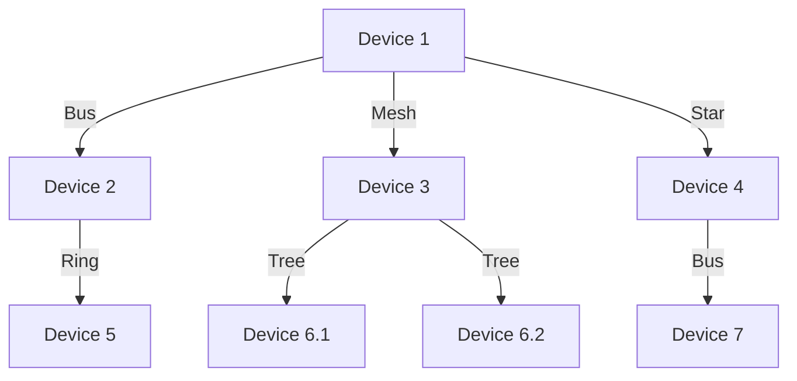

# Network Topologies
## Bus Topology
This creates a simple network topology with an Internet connection, a firewall, a switch, and three computers.


### Ring Topology
This represents a ring topology where each computer is connected to exactly two other computers forming a closed loop.
```mermaid
graph TD
  A[Device 1] -->|Ring| B[Device 2]
  B -->|Ring| C[Device 3]
  C -->|Ring| D[Device 4]
  D -->|Ring| E[Device 5]
  E -->|Ring| A
 
 ```
 
## Star Topology
This represents a star topology where all computers are connected to a central switch.
```mermaid
graph TD
  A[Device 1] -->|Switch| S[Central Switch]
  B[Device 2] -->|Switch| S
  C[Device 3] -->|Switch| S
  D[Device 4] -->|Switch| S
  E[Device 5] -->|Switch| S

```
## Mesh

## Tree

## Hybrid


