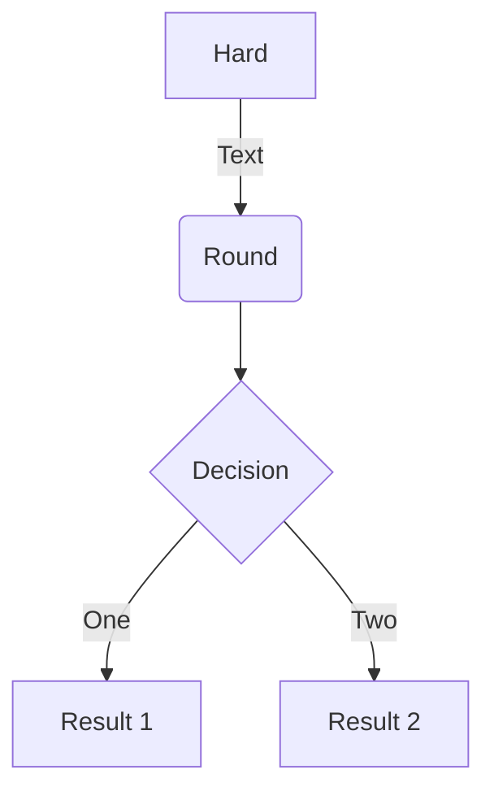

# Numbers & Operators

## Different types of Operators
### Mathematical Operators
	1. Addition (+)
	2. Subtraction (-)
	3. Multiplication (*)
	4. Division (/)
	5. Floor Division (//)
	6. Exponentiation (**)
	7. Modulus (%)
### Order of Operations
	1. Parentheses
	2. Exponentiation
	3. Multiplication
	4. Division
	5. Addition
	6. Subtraction
### Comparison Operators
	1. Equal to (==)
	2. Not Equal to (!=)
	3. Greater than (>)
	4. Less than (<)
	5. Greater than or equal to (>=)
	6. Less than or equal to (<=)
### Logical Operators
	1. and
	2. or
	3. not
### Bitwise Operators
	1. Bitwise AND (&)
	2. Bitwise OR (|)
	3. Bitwise NOT (~)
	4. Bitwise XOR (^)
	5. Bitwise right shift (>>)
	6. Bitwise left shift (<<)#
### The following functions can convert between data types:
    1. int()
    2. float()
    3. str()
    4. bool()
    5. None

# Loops
## loops:
    1. for
    2. while
    3. Nested Loops
## keywords:
    1. break
    2. continue
    3. pass
## functions:
    1. range()
    2. enumerate()
    3. zip()
    4. reversed()
    5. sorted()
    6. map()
    7. filter()
    8. lambda

# Import Statements
1. Can use the following import statements:
    1. import
    2. from
    3. as
    4. import *
    5. from * import

# Pseudocode
1. From algorithms to pseudocode 
	1. Pseudocode
		1. a set of human-readable statements for delineating the steps of an algorithm
	2. Pseudocode is not a program you can run, but provides more detail than an algorithm, easing the transition from idea to program code
	3. Used to help brainstorm before you code
	4. Easy to write and help determine logic of a problem
	5. Non-technical team members can understand
2. Pseudocode guidelines
	1. Some keywords and style conventions are derived from programming languages
	2. In pseudocode, you work with variables, which hold values that might change during program execution, and computations
Pseudocode Examples: Output
```python
Python • print(“Game Over”)
```
```pseudocode
Display ‘Game Over’
```
Pseudocode Examples: Retrieve Information
```python
Name = input(“Enter name:”)
```
```pseudocode
Prompt for name Or Get name
```
# Mermaid

To make a flowchart, you can use the mermaid extension.  You can use the following code to make a flowchart:




# Python Interactive Shell
1. Python Interactive Shell:
    1. Open at command line using command: python
    2. Interfaces with Python interpreter.
    3. Allows user to run Python commands at command line.
    4. Sample command: ```print("Message")```
    5. Anything typed into shell is echoed back.• Can even do calculations.

Example:

Simple Print Statement 
```python 
print(“Happy Birthday”)
```
Print Calculations

```python
print(5 * 4)
print(24 + 6 * 3)
```

Print whole numbers using commas to separate

```python
print(0,1,2,3,4)
```
Repeat Strings
```python
print(“- - - - -”)
print(“-” * 5)
print(“hello   “ * 5)
```

# Writing and Running Simple Scripts

1. Can also run code saved in file.
	1. These files are called modules.
	2. A script is a module that is run from the command line.
	3. To run a script, type the following at the command line:
        1. python scriptname.py
        2. Example: python hello.py
	4. To run a script, you must be in the same directory as the script.
	5. To run a script, you must have the correct permissions.

# Running a File Containing Invalid Commands
1. Invalid commands in script will cause errors
2. Output will be stack trace (also called traceback)
    1. Gives error message and line number where error occurred.
    2. Can be used to find and fix errors in code.
    3. Reads from bottom up.
    EXAMPLE:
    ```python
    print(invalid instruction)

### Passing User Argument to Scipts
1.  To Pass arguments to scripts, use the sys module. 
   ```python
   import sys
   print(sys.argv)
   ```
2. The sys function allows users to read command-line arguments that have been passed to the interpreter.
3. The sys.argv list contains the argument(s) passed to the script.
    1. Can pass any # of argument(s) to script.
    2. First argument is always the name of the script. Example: ```sys.argv[0]```
    3. Second argument is the first argument passed to the script. Example: ```sys.argv[1]```

Example Print Statement:
```python
import sys
print("First Name: ", sys.argv[1])
print("Middle Name: ", sys.argv[2])
print("Last Name: ", sys.argv[3])
```
Example Output:
```python
python name.py John Paul Smith
First Name: John
Middle Name: Paul
Last Name: Smith
```

# Variables
1. Variables can reference values of different data types.
	1. They refer to values in memory
    1. They don’t need to be declared before use.
    2. ```X = “No need to declare this string before use”```
3. Value and ```type``` can change during runtime.
4. Use type function to check type. 
    Example: ```type(X)```
# Naming Identifiers and Reserved Words
1. Some rules for variables and other identifiers:
    1. Can consist of upper and lowercase letters, underscores, unicode identifiers, and digits 0 to 9.
    2. Cannot begin with digit.
    3. No other characters can be in identifiers.
        1. Module names with spaces should be avoided.
    4. Python reserved words or keywords can’t be used
2. Identifier names are case sensitive

# Python Naming Conventions
## These are guidelines only
1.  Compound variable names should be written in snake case notation.
*  Example: ```snake_case```
2. Avoid using the following• Example: PascalCase
*   Example: ```camelCase```
3. Constant names should be in all caps.
4. Avoid lowercase L / uppercase O as single character names.

# Data Type Variables
1. Python has 5 data types:
    1. Integer
        1. Whole numbers (Numeric Values)
        2. Can be positive or negative
        3. Arithmetic operations can be performed on integers
    2. Float
        1. Decimal numbers (Numeric Values)
        2. Can be positive or negative
        3. Arithmetic operations can be performed on floats
    3. String
        1. Sequence of characters between quotes
        2. Can be single or double quotes
        3. Can contain letter,#'s or symbols
    4. Boolean
        1. True or False
        2. Used in conditional statements
    5. None
        1. Represents nothing
        2. Used in conditional statements

## Conversion Between Data Types
1. Can convert between data types using the following functions:
    1. int()
    2. float()
    3. str()
    4. bool()
    5. None

## Assigning Values to Variables
1. Can assign values to variables using the assignment operator ( = ).
    1. Example: ```X = 5```
2. Can assign multiple values to multiple variables in a single line.
    1. Example: ```X, Y, Z = 1, 2, 3```
3. Error is raised if number of variables on left side of assignment operator does not match number of values on right side.
    1. Example: ```X, Y, Z = 1, 2``` will raise an error.

#### Example1
Simple Print statement to conceatrate string values
```python
print("I Love Python + " "I Love Programming")
print("I Love Python" + " " + "I Love Programming")
```
or

```python
message = "I Love Python"
print(message + " " + "I Love Programming")
print( message , "!" *3 ")
```
#### Example2
Multiple Assignment
```python
a , b ,c = 1 , 2 , 3
print(a)
print(b)
print(c)

or 

print(a,b,c)
```

# User Input, Comments, and Indentations

1. User Input from the Keyboard
2. Use input() function to get user input from keyboard.
    1. Example: ```message = input()```
3. Program execution halts until user inputs value and presses Enter key.
4. Passing in a Prompt to the Input Function
    1. Syntax: ```input("Insert prompt here")```
5. Using Different Input Data Types in Your Program
6. The input() function always returns string.
7. Use built-in int() function to convert to integer

#### Example1
```python
age = input("Enter your age: ")
print("You are " + age + " years old.")
```
#### Example2
```python
age = int(input("Enter your age: "))
print("You are " + str(age) + " years old.")
```

# Comments
## Block
1. Start with # sign.
2. Comes on line before statement it annotates.
3. Placed at same indent level as statement.
## Inline
1. Start with # sign.
2. Placed on same line as statement it annotates.
## Documentation String (docstrings)
1. String wrapped in triple (double or single) quotation marks.
2. Module docstrings should be at beginning of file.
3. Can be used for multiple line comments.

# Types of Numbers

## Integers
1. Numerical Data Comprised of Whole Numbers
2. Can be Positive or Negative
3. Can be used in Arithmetic Operations
4. Unlimited Precision - No limit to how large or small a number can be
5. Type : ```int```

## Floating Point Numbers
1. Numerical Data Comprised of Decimal Numbers
2. Can be Positive or Negative
3. Can be used in Arithmetic Operations
4. Limited Precision - Can only represent a finite number of digits\
5. Type : ```float```

## Binary, Hexadecimal, Octal

 1. Numerical Data Comprised of Binary,Hexadecimal,Octal Numbers
 2. Can be Positive or Negative
 3. Can be used in Arithmetic Operations
 4. Limited Precision - Can only represent a finite number of digits
 5. Type : ```bin```,```hex```,```oct``` respectively

# Operators

## Arithmetic Operators
1. Addition : ```+```
2. Subtraction : ```-```
3. Multiplication : ```*```
4. Division : ```/```
5. Floor Division : ```//```
6. Modulus : ```%```
7. Exponent : ```**```
## Order of Operation
1. Parentheses
2. Exponentiation
3. Multiplication
4. Division
5. Addition
6. Subtraction


# String Operations and Methods

1. Strings are sequence of characters.
2. Can be enclosed in either double or single quotes.
3. Double-quoted string can contain single quotes.
4. Single-quoted string can contain double quotes.
5. Can use triple quotes (''' or """) to build multiline string.
6. Can use * operator to repeat strings.
	1. ```Example: print('Alibaba and the', 'thieves '* 40)```
7. Can use + to concatenate stings.
	1. ```Example: "I " + "love " + "Python"```
8. Strings are immutable: unable to be changed
9. Strings can be indexed.
10. First character is at index 0

# Indexing

1. Indexing is used to access individual characters in a string.
2. Indexing is zero-based.
3. Indexing can be done from the beginning of the string or from the end of the string.
4. Indexing can be done using square brackets.
5. Indexing can be done using negative numbers.
6. Indexing can be used to access individual characters in a string.
7. Indexing can be used to access a range of characters in a string.

# Slicing
1. Slicing is used to access a range of characters in a string.
2. Slicing can be done using square brackets.
3. Slicing can be done using negative numbers.
4. Slicing can be used to access a range of characters in a string.

Example

```python

Syntax: string[start_index: end_index]

```

# Length

1. Length determined by number of characters inside string.
2. Get length with built-in len function1.  
3. Length is determined by the number of characters inside a string.
4. Get length with built-in len function.

# String Formatting

1.  String formatting is used to insert values into a string.
2.  String formatting can be done using the % operator.
3. String Interpolation• Process of evaluating string that has placeholders.
4. f-strings (formatted strings) are used

# String Methods

1.  String methods are used to manipulate strings.
	1. ```str.capitalize()```
	2. Returns copy of string with first letter capitalized.• last_name = input("Type your last name: ")• print(last_name.capitalize())• >>> Clayborn
2. ```str.lower()```
	1. . Returns copy of string with first letter capitalized.
3. str.upper()
	1. Returns copy of string with first letter capitalized.
4. str.startswith()
        1. Returns Boolean after checking whether string starts with specified prefix.
5. str.endswith()
	1. Returns Boolean after checking whether string ends with specified suffix.
6. str.strip()
	1. Returns copy with leading and trailing spaces removed.
7. str.replace()
	1. Returns copy with all occurrences of specified substring replaced with new one.

  
# Lists

1.  Lists are used to store multiple items in a single variable.
2.  Lists are created using square brackets.
3.  Lists can contain items of different types.
4.  Lists can contain duplicate items.
5. In Pythob Arrays are Knonw as Lists
6. Lists are aggregate data types, which means they are used to store multiple values in a single variable.
7. Some Characteristics of Lists
    1. Lists are mutable
    2. Lists are ordered
    3. Lists are indexed
    4. Lists can contain duplicate values
    5. Lists can contain values of different data types
8. Concatenation
  ```Example: [1, 2, 3] + [4, 5, 6]```
5. Repetition
  ```Example: ['Hi!'] * 4```
6. Membership
  ```Example: 3 in [1, 2, 3]```
7. Iteration
  ```Example: for x in [1, 2, 3]: print(x)```


# Booleans

1.  Booleans are used to represent truth values.

2.  Booleans are created using the bool function.

3. True or False are the only two values of the bool type.

# Comparison Operators

1.  Comparison operators are used to compare values.  

2.  Comparison operators return a Boolean value.

3.  Comparison operators can be used to compare numbers.

4. <: less than

5. >: greater than

6. <=: less than or equal to

7. >=: greater than or equal to

8. ==: equal to

9. !=: not equal to


# Program Flow

1. Describes the way in which statements are executed in a program.

2. Python has a top-down program flow.

  

# Control Statements

1. Control statements are used to control the flow of a program.

2. The two main control statements are:

    1. ```if```

    2. ```while```

  

# if Statement

1. The ```If``` statement allows execution of block of code if condition is true, otherwise it can run block in else clause.

    1. ```else``` is optional.

    2. ```else if``` is abbreviated as ```elif```

2. Can chain multiple ```if``` statements together.

Example:

```python

if condition1:

    # do something

elif condition2:

    # do something else

else:

    # do something else

```

# while Statement

1. The ```while``` statement allows execution of block of code while condition is true.

2. Can chain multiple ```while``` statements together.

3. Allows execution of block of code repeatedly until condition is false.

    1. else clause is optional.

4. Can Also have ```else``` clause.

    1. This will be executed exactly once when the condition becomes false.

  

Example:

```python  

while condition:

    # do something

else:

    # do something else

```

# While vs If

1. ```if``` gives opportunity to branch execution of code based on condition.

2. ```while``` gives opportunity to run block of code multiple times as long as condition is true.

    1. Can be considered a loop.

Example:

```python

if condition:

    # do something

else:

    # do something else

```

Example:

```python

while condition:

    # do something

else:

    # do something else

```

  

Here is the updated content with the lesson numbers removed and the topics retained:

---

# Loops

1. Way to execute a block of code multiple times.
2. Used to iterate (or loop) over iterables.
3. Iterables are objects that can be iterated over, such as strings, lists, tuples, dictionaries, sets, and files.

Example:

```python
for item in iterable:
    # do something
```

# The for Loop

1. The `for` loop is used to iterate over a sequence (that is either a list, a tuple, a dictionary, a set, or a string).
2. Also referred to as the `for in` loop.
3. Used when you want to repeatedly execute a block of code a number of times.
4. Runs a predetermined number of times, unlike while loops that run until a condition is met.

Example:

```python
for item in iterable:
    # do something
```

# Using else with Loops

1. The `else` statement can be used with `for` loops.
2. It will execute once when the loop exits cleanly.
3. Useful for debugging.

Example:

```python
for item in iterable:
    # do something
else:
    # do something else
```

# The range() Function

1. The `range()` function returns a sequence of numbers, starting from 0 by default, incrementing by 1 (by default), and ending at a specified number.
2. It can be used to iterate over a sequence of numbers.

Syntax:

```python
range([start], stop, [step])
```

- start: starting number of the sequence.
- stop: generate numbers up to, but not including this number.
- step: difference between each number in the sequence.

Example:

```python
for i in range(10):
    print(i)
```

Another Example:

```python
for a in range(1, 4):  # creates a range of numbers starting at 1 and ending at 4
    for b in range(a):  # selects values from range variable a
        print("*", end=' ')
    print()
```

# Nesting Loops

1. Nesting loops refers to placing loops inside other loops.
2. It is important for accessing data inside complex data structures.
3. There is no limit to how deeply you can nest loops.

Example:

```python
for i in range(1, 11):
    for j in range(1, 11):
        print(i * j, end='\t')
    print()
```

# The break Statement

1. The `break` statement allows you to exit a loop based on an external trigger.
2. It is usually used in conjunction with an `if` statement.

Example:

```python
for value in "Python":
    if value == "t":
        break
    print(value)
```

Output:

```
P
y
```

# The continue Statement

1. The `continue` statement allows you to skip over part of a loop where an external condition is triggered but goes back to the top of the loop to continue execution.
2. It is usually used in conjunction with an `if` statement.

Example:

```python
for value in "Python":
    if value == "t":
        continue
    print(value)
```

# The pass Statement

1. The `pass` statement is a null operation; nothing happens when it executes.
2. It allows you to handle an external trigger condition without affecting the execution of the loop.

Example:

```python
for value in "Python":
    if value == "t":
        pass
    print(value)
```

# Types of Functions

1. A function is a group of statements within a program that performs a specific task.
2. Functions allow you to reuse code.
3. There are two types of functions:
    1. Built-in functions
    2. User-defined functions
4. Built-in functions are available in Python without the need for importing.

Examples:

```python
input([prompt]): takes input from the user
print(): displays output
```

## User-Defined Functions

1. User-defined functions are functions written by the user.
2. They help organize a program into logical fragments and allow code reuse.
3. The steps to define a function are:
    1. Use the `def` keyword followed by the function name.
    2. Add parameters within parentheses, and end the definition with a colon. Parameters are optional.
    3. Write the logic for the function.
    4. Use the `return` keyword to return output. If not used, `None` is returned.

Syntax:

```python
def function_name(parameter_one, parameter_two, parameter_n):
    # logic
    return output
```

Example:

```python
def add_numbers(num_one, num_two):
    return num_one + num_two
```

## Calling a Function

1. Functions can be called at an interactive prompt or from within some other part of your code.
2. The names of arguments passed to a function do not need to match the parameter names, but the number of arguments should match the number of parameters.

Example:

```python
def myfunc(val):
    print("Hello " + val)

myfunc("Python")
myfunc("Ruby")
```

Output:

```
Hello Python
Hello Ruby
```

## Global and Local Variables

1. Local variables are defined inside the body of a function and have local scope, meaning they are only available within the function in which they are defined.
2. Global variables are defined outside of a function body and have global scope, meaning they are available both outside and inside functions.

Example:

```python
def myfunc():
    X = 10  # this is an example of a local scope
Y = 20  # this is an example of a global scope
```

## Function Return

1. The `return` statement is used to return something to the caller of the function.
2. It is not necessary for functions that do not need to return a value.
3. If `return` is not used, the function returns `None`.

Example:

```python
def myfunc(val):
    return val * 2

print(myfunc(15))
```

Output:

```
30
```

# Required Arguments

1. Required arguments must be present when calling a function and need to be in the correct order.

Example:

```python
def division(first, second):
    return first / second

value = division(10, 5)
print(value)
```

Output:

```
2.0
```

# Keyword Arguments

1. Keyword arguments are identified by parameter names.

Example function call:

```python
quotient = division(second=2, first=10)
```

2. This ensures arguments are passed to the correct parameters, regardless of their order.

Example:

```python
def my_bill(tiprate, tax, subtotal):
    return (subtotal * tax) + (subtotal * tiprate)

total = my_bill(subtotal=20, tiprate=0.15, tax=1.06)
print(round(total, 2))
```

Output:

```
24.2
```

# Default Arguments

1. Default arguments take a default value if no argument is passed during a function call.

Example:

```python
def division(first, second=2):
    return first / second

quotient = division(10)
print(quotient)
```

2. You can pass an argument to override the default value.

Example:

```python
def multiple_display(message='default', times=2):
    for x in range(times):
        print(message)

multiple_display()
```

Output:

```
default
default
```

Another Example:

```python
multiple_display('roadrunner', 3)
```

Output:

```
roadrunner
roadrunner
roadrunner
```

# Variable Number of Arguments

1. Python allows a variable number of arguments with the `*args` syntax.

Example function definition:

```python
def print_arguments(*args):
    for x in args:
        print(x)
```

2. You can use a loop to iterate over the arguments.

Example:

```python
def student(name, age, *otherinfo):
    print("name: ", name)
    print('age: ', age)
    for x in otherinfo:
        if type(x) == bool:
            continue
        print(x)

student('Eric', 19, "Python", False, "Instructor", 23.6)
```

# Anonymous Functions

1. Anonymous functions are also called lambda functions.
2. They do not need to be named in their definition and are usually throwaway functions, not called in other parts of the code.

Syntax:

```python
lambda argument_list: expression
```

3. Lambda functions are often used in combination with `map()`, `reduce()`, and `filter()` functions.

Example:

```python
myfunc = lambda val: val * 2
print(myfunc(15))
```

# Summary of Functions

In this module:
- We learned about the various types of functions in Python, as well as their differences, syntax, and use cases.
- We covered how and where to apply the different types of functions, and how they can be used to help break your programs into smaller subprograms that achieve a specific purpose.
- We also saw how the use of functions can help reuse functionality in our code and avoid repeating the same blocks of code.

### Lists and Tuples

1. **List**:
    - A data structure that holds ordered collections of related data.
    - Known as arrays in other languages.
    - Properties:
        1. Ordered: items have a defined order that will not change.
        2. If you add new items to a

 list, the new items will be placed at the end of the list.
        3. Allow duplicates: lists can contain duplicate elements.
        4. Mutable: items can be modified after the list is created.
    - Lists are created using `[]`.

Example:

```python
mylist = ["apple", "banana", "cherry"]
print(mylist)
```

Output:

```
['apple', 'banana', 'cherry']
```

Another Example:

```python
anotherlist = ['apples', 5, 3.2]
print(anotherlist)
```

Output:

```
['apples', 5, 3.2]
```

2. **Tuple**:
    - Similar to a list, but immutable (cannot be changed after creation).
    - Syntax:
        1. Created using `()`.

Example:

```python
mytuple = ("apple", "banana", "cherry")
print(mytuple)
```

Output:

```
('apple', 'banana', 'cherry')
```

3. **Accessing Items in a List or Tuple**:
    - Use the index operator `[]` to access elements of a list or tuple.

Example:

```python
fruits = ["apple", "banana", "cherry"]
print(fruits[1])
```

Output:

```
banana
```

Another Example:

```python
fruits = ("apple", "banana", "cherry")
print(fruits[-1])
```

Output:

```
cherry
```

4. **Changing a List Item**:
    - The value of specific items can be changed by referring to the index number.
    - You cannot change the items of a tuple, as they are immutable.

Example:

```python
thislist = ["apple", "banana", "cherry"]
thislist[1] = "blackcurrant"
print(thislist)
```

Output:

```
['apple', 'blackcurrant', 'cherry']
```

5. **Loop Through a List or Tuple**:
    - You can loop through the items of a list or tuple using a `for` loop.

Example:

```python
fruits = ["apple", "banana", "cherry"]
for x in fruits:
    print(x)
```

Output:

```
apple
banana
cherry
```

Another Example:

```python
fruits = ("apple", "banana", "cherry")
for x in fruits:
    print(x)
```

Output:

```
apple
banana
cherry
```

6. **Check if Item Exists**:
    - Use the `in` keyword to check if an item exists in a list or tuple.

Example:

```python
fruits = ["apple", "banana", "cherry"]
if "apple" in fruits:
    print("Yes, 'apple' is in the fruits list")
```

Output:

```
Yes, 'apple' is in the fruits list
```

7. **List Length**:
    - Use the `len()` function to determine the number of items in a list or tuple.

Example:

```python
fruits = ["apple", "banana", "cherry"]
print(len(fruits))
```

Output:

```
3
```

8. **Adding Items**:
    - Use the `append()` method to add an item to the end of the list.
    - Tuples are immutable, so items cannot be added to a tuple.

Example:

```python
fruits = ["apple", "banana", "cherry"]
fruits.append("orange")
print(fruits)
```

Output:

```
['apple', 'banana', 'cherry', 'orange']
```

9. **Removing Items**:
    - Use the `remove()` method to remove a specific item.
    - Use the `pop()` method to remove an item at a specified index, or use it without an index to remove the last item.
    - Use the `del` keyword to remove an item at a specific index or to delete the list entirely.
    - Tuples are immutable, so items cannot be removed.

Example:

```python
fruits = ["apple", "banana", "cherry"]
fruits.remove("banana")
print(fruits)
```

Output:

```
['apple', 'cherry']
```

Another Example:

```python
fruits = ["apple", "banana", "cherry"]
fruits.pop()
print(fruits)
```

Output:

```
['apple', 'banana']
```

Another Example:

```python
fruits = ["apple", "banana", "cherry"]
del fruits[0]
print(fruits)
```

Output:

```
['banana', 'cherry']
```

Another Example:

```python
fruits = ["apple", "banana", "cherry"]
del fruits
```

10. **Copying a List**:
    - Use the `copy()` method or `list()` function to copy a list.
    - Tuples are immutable, so copying is usually not relevant.

Example:

```python
thislist = ["apple", "banana", "cherry"]
mylist = thislist.copy()
print(mylist)
```

Another Example:

```python
thislist = ["apple", "banana", "cherry"]
mylist = list(thislist)
print(mylist)
```

11. **Join Two Lists or Tuples**:
    - Use the `+` operator to join two lists or tuples.

Example:

```python
list1 = ["a", "b", "c"]
list2 = [1, 2, 3]
list3 = list1 + list2
print(list3)
```

Output:

```
['a', 'b', 'c', 1, 2, 3]
```

Another Example:

```python
tuple1 = ("a", "b", "c")
tuple2 = (1, 2, 3)
tuple3 = tuple1 + tuple2
print(tuple3)
```

Output:

```
('a', 'b', 'c', 1, 2, 3)
```

12. **List Constructor**:
    - Use the `list()` function to create a new list.
    - Tuples can be created using the `tuple()` function.

Example:

```python
thislist = list(("apple", "banana", "cherry"))  # note the double round-brackets
print(thislist)
```

Output:

```
['apple', 'banana', 'cherry']
```

---

This should be closer to what you're looking for, focusing on the key concepts without unnecessary formatting.